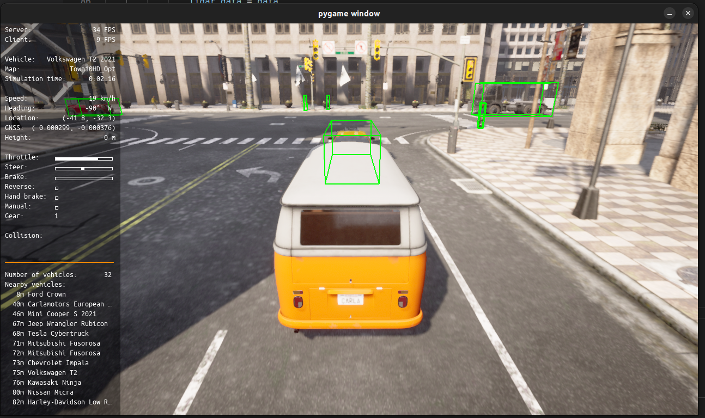
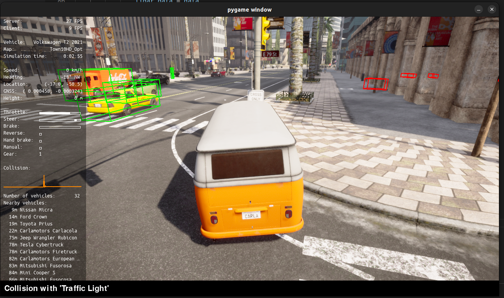
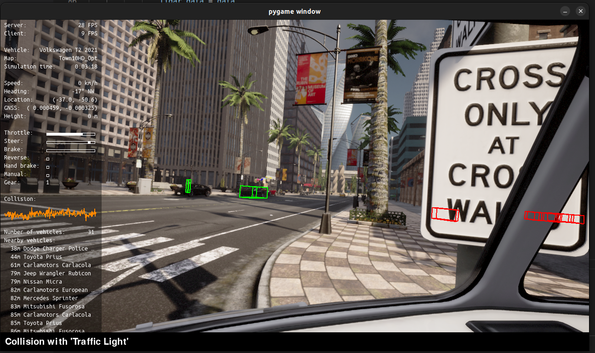
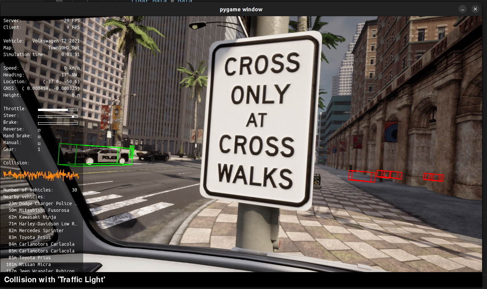
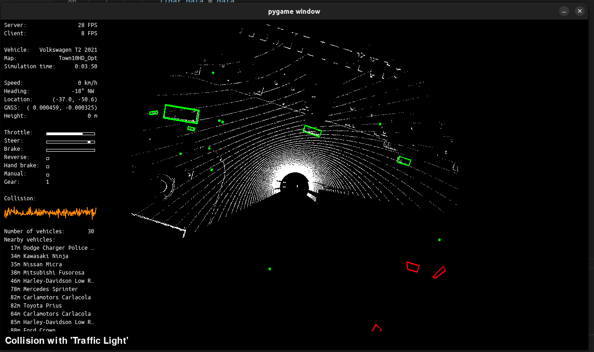

# Report

## Part 1 - Environment setup

The environment is successfully running with all elements working properly.

## Part 2 - Visualization of ground truth without detector

The visuals of the ground truth are as follows. Running the system with the default configuration of sensors. 2 cameras, 1 lidar and 1 GNSS(GPS). 

### Visualization of ground truth

## Part 3 - Integrating pretrained perception model

Since a off the box detectron is being used, the model outputs are very bad and resulting in a core dump. The ghost boxes as detected are shown below with differing camera views.

### Detections

### Left camera

### Right camera

### LiDAR sensor view
